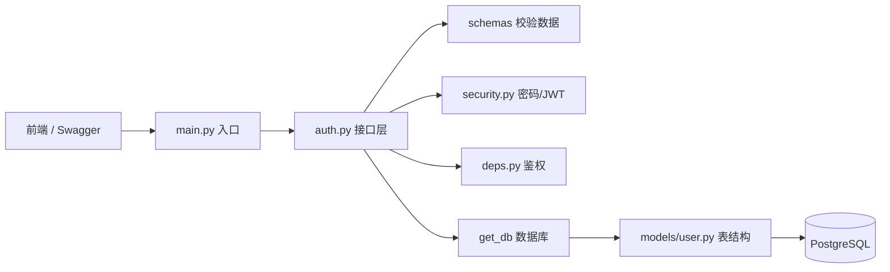

很好，注册成功了。下面按**从整体到细节**的方式，把你这套用户认证代码讲清楚。

---

## 一、整体架构：各文件分工



可以把它理解成**分层**：

| 层级 | 文件 | 职责 |
|------|------|------|
| 入口 | `main.py` | 启动应用，挂载路由 |
| 配置 | `settings.py` | 读 `.env`，提供数据库地址、JWT 密钥 |
| 接口 | `auth.py` | 处理 HTTP 请求（注册/登录/我） |
| 数据校验 | `schemas/user.py` | 校验请求格式，定义响应格式 |
| 数据库表 | `models/user.py` | 定义 `users` 表长什么样 |
| 数据库连接 | `db.py` | 连接 PostgreSQL，提供 session |
| 安全 | `security.py` | 密码加密、JWT 生成/解析 |
| 依赖注入 | `deps.py` | 从 Token 里取出当前用户 |
| 迁移 | `alembic/env.py` | 管理数据库表结构变更 |

---

## 二、三条核心业务流程

### 1. 注册流程

```
前端发 JSON → UserCreate 校验 → 查重 → 密码哈希 → 写入 users 表 → 返回 UserResponse
```

### 2. 登录流程

```
前端发 JSON → UserLogin 校验 → 查用户 → 验证密码 → 生成 JWT → 返回 Token
```

### 3. 获取当前用户（/me）

```
请求头带 Token → 解析 JWT → 查用户 → 返回 UserResponse
```

---

## 三、逐文件讲解

### 1. `app/main.py` — 应用入口

```1:12:d:\code\python\enterprise-knowledge-hub\app\main.py
from fastapi import FastAPI

from app.api.v1.auth import router as auth_router

app = FastAPI(title="Enterprise Knowledge Hub")

app.include_router(auth_router, prefix="/api/v1/auth", tags=["auth"])


@app.get("/health")
def health():
    return {"status": "ok"}
```

| 代码 | 作用 |
|------|------|
| `FastAPI(...)` | 创建 Web 应用实例 |
| `include_router(auth_router, prefix="/api/v1/auth")` | 把认证相关接口挂到 `/api/v1/auth` 下 |
| `@app.get("/health")` | 健康检查，用来确认服务是否在跑 |

最终路由：
- `POST /api/v1/auth/register`
- `POST /api/v1/auth/login`
- `GET /api/v1/auth/me`
- `GET /health`

---

### 2. `app/core/settings.py` — 配置中心

```4:27:d:\code\python\enterprise-knowledge-hub\app\core\settings.py
class AppSettings(BaseSettings):
    model_config = SettingsConfigDict(env_file=".env", env_file_encoding="utf-8")

    # 数据库
    pg_host: str
    pg_port: int
    pg_user: str
    pg_password: str
    pg_database: str

    # JWT
    secret_key: str = "change-me-in-production"  # 生产环境必须改
    algorithm: str = "HS256"
    access_token_expire_minutes: int = 30

    @property
    def database_url(self) -> str:
        return (
            f"postgresql+asyncpg://{self.pg_user}:{self.pg_password}"
            f"@{self.pg_host}:{self.pg_port}/{self.pg_database}"
        )


settings = AppSettings()
```

| 代码 | 作用 |
|------|------|
| `BaseSettings` | 自动从 `.env` 读取配置 |
| `pg_host` 等 | 数据库连接参数 |
| `secret_key` | JWT 签名密钥，防伪造 |
| `access_token_expire_minutes` | Token 有效期（30 分钟） |
| `database_url` | 拼出完整数据库连接串 |

**好处：** 密码、密钥不写死在代码里，换环境只改 `.env`。

---

### 3. `app/infra/db.py` — 数据库连接

```9:35:d:\code\python\enterprise-knowledge-hub\app\infra\db.py
class Base(DeclarativeBase):
    pass


engine = create_async_engine(
    settings.database_url,
    echo=True,  # 开发时打印 SQL，上线可改 False
    pool_pre_ping=True,
)

AsyncSessionLocal = async_sessionmaker(
    bind=engine,
    class_=AsyncSession,
    expire_on_commit=False,
)


async def get_db() -> AsyncGenerator[AsyncSession, None]:
    async with AsyncSessionLocal() as session:
        try:
            yield session
            await session.commit()  # 没异常就提交
        except Exception:
            await session.rollback()  # 有异常就回滚
            raise
        finally:
            await session.close()
```

| 代码 | 作用 |
|------|------|
| `Base` | 所有 ORM 模型的父类 |
| `create_async_engine` | 创建异步数据库引擎（连接池） |
| `async_sessionmaker` | 工厂：每次请求创建一个 session |
| `get_db()` | 给每个请求分配数据库连接，用完自动关闭 |
| `yield session` | FastAPI 的依赖注入模式：请求前创建，请求后清理 |
| `commit` / `rollback` | 成功提交，失败回滚 |

**类比：** `get_db` 像「每次借一本书，用完还回去」，避免连接泄漏。

---

### 4. `app/models/user.py` — 数据库表定义（ORM）

```9:19:d:\code\python\enterprise-knowledge-hub\app\models\user.py
class User(Base):
    __tablename__ = "users"

    id: Mapped[int] = mapped_column(primary_key=True, autoincrement=True)
    username: Mapped[str] = mapped_column(String(50), unique=True, index=True)
    email: Mapped[str] = mapped_column(String(100), unique=True, index=True)
    hashed_password: Mapped[str] = mapped_column(String(255))
    created_at: Mapped[datetime] = mapped_column(
        DateTime(timezone=True),
        server_default=func.now(),
    )
```

| 字段 | 作用 |
|------|------|
| `id` | 主键，自增 |
| `username` | 登录名，唯一，有索引（查询快） |
| `email` | 邮箱，唯一 |
| `hashed_password` | **哈希后的密码**，绝不存明文 |
| `created_at` | 注册时间，数据库自动生成 |

**ORM 是什么？**  
Python 类 `User` ↔ 数据库表 `users`，用 Python 对象操作数据库，不用手写 SQL。

---

### 5. `app/schemas/user.py` — 请求/响应数据格式

```6:28:d:\code\python\enterprise-knowledge-hub\app\schemas\user.py
class UserCreate(BaseModel):
    username: str = Field(min_length=3, max_length=50)
    email: EmailStr
    password: str = Field(min_length=6, max_length=100)


class UserLogin(BaseModel):
    username: str
    password: str


class UserResponse(BaseModel):
    model_config = ConfigDict(from_attributes=True)

    id: int
    username: str
    email: EmailStr
    created_at: datetime


class Token(BaseModel):
    access_token: str
    token_type: str = "bearer"
```

| 类 | 用途 | 关键点 |
|----|------|--------|
| `UserCreate` | 注册请求体 | 校验用户名长度、邮箱格式、密码至少 6 位 |
| `UserLogin` | 登录请求体 | 只要用户名 + 密码 |
| `UserResponse` | 返回给前端 | **不含 password**，`from_attributes=True` 可从 ORM 对象转换 |
| `Token` | 登录成功返回 | `access_token` + `token_type` |

**Model vs Schema 区别：**

| | Model (`models/`) | Schema (`schemas/`) |
|--|-----------------|---------------------|
| 对应 | 数据库表 | API 入参/出参 |
| 框架 | SQLAlchemy | Pydantic |
| 例子 | `User` 表 | `UserCreate`、`UserResponse` |

---

### 6. `app/core/security.py` — 安全核心

```9:41:d:\code\python\enterprise-knowledge-hub\app\core\security.py
def hash_password(password: str) -> str:
    return bcrypt.hashpw(password.encode("utf-8"), bcrypt.gensalt()).decode("utf-8")


def verify_password(plain_password: str, hashed_password: str) -> bool:
    return bcrypt.checkpw(
        plain_password.encode("utf-8"),
        hashed_password.encode("utf-8"),
    )


def create_access_token(subject: str) -> str:
    expire = datetime.now(timezone.utc) + timedelta(
        minutes=settings.access_token_expire_minutes
    )
    payload = {
        "sub": subject,  # 存用户 id（字符串）
        "exp": expire,
    }
    return jwt.encode(payload, settings.secret_key, algorithm=settings.algorithm)


def decode_access_token(token: str) -> str | None:
    try:
        payload = jwt.decode(
            token,
            settings.secret_key,
            algorithms=[settings.algorithm],
        )
        subject: str | None = payload.get("sub")
        return subject
    except JWTError:
        return None
```

#### 密码哈希

```
明文 "123456" → bcrypt → "$2b$12$xxxxx..."（不可逆）
```

- 注册：`hash_password` 把密码变成乱码再存库
- 登录：`verify_password` 比对明文和哈希
- **即使数据库泄露，攻击者也无法还原原始密码**

#### JWT Token

```
登录成功 → create_access_token(user_id) → "eyJhbGciOiJIUzI1NiIs..."
```

Token 里包含：
- `sub`：用户 ID
- `exp`：过期时间

后续请求在 Header 里带 `Authorization: Bearer <token>`，服务端用 `decode_access_token` 解析出用户 ID。

**为什么用 JWT？**  
服务端不用存 session，无状态、易扩展。

---

### 7. `app/core/deps.py` — 依赖注入（鉴权）

```14:35:d:\code\python\enterprise-knowledge-hub\app\core\deps.py
async def get_current_user(
    token: str = Depends(oauth2_scheme),
    db: AsyncSession = Depends(get_db),
) -> User:
    user_id = decode_access_token(token)
    if user_id is None:
        raise HTTPException(
            status_code=status.HTTP_401_UNAUTHORIZED,
            detail="无效或过期的 Token",
            headers={"WWW-Authenticate": "Bearer"},
        )

    result = await db.execute(select(User).where(User.id == int(user_id)))
    user = result.scalar_one_or_none()

    if user is None:
        raise HTTPException(
            status_code=status.HTTP_401_UNAUTHORIZED,
            detail="用户不存在",
        )

    return user
```

**执行步骤：**

1. `oauth2_scheme` 从请求头取出 `Bearer Token`
2. `decode_access_token` 解析出 `user_id`
3. 查数据库拿到 `User` 对象
4. 返回 `User`，供接口使用

**用法：** 任何需要登录的接口加一行：

```python
current_user: User = Depends(get_current_user)
```

FastAPI 会自动完成鉴权，失败直接返回 401。

---

### 8. `app/api/v1/auth.py` — 业务接口（核心）

#### 注册 `POST /register`

```17:44:d:\code\python\enterprise-knowledge-hub\app\api\v1\auth.py
async def register(
    data: UserCreate,
    db: AsyncSession = Depends(get_db),
):
    # 1. 检查用户名或邮箱是否已存在
    result = await db.execute(
        select(User).where(
            or_(User.username == data.username, User.email == data.email)
        )
    )
    existing = result.scalar_one_or_none()
    if existing:
        raise HTTPException(
            status_code=status.HTTP_409_CONFLICT,
            detail="用户名或邮箱已存在",
        )

    # 2. 创建用户
    user = User(
        username=data.username,
        email=data.email,
        hashed_password=hash_password(data.password),
    )
    db.add(user)
    await db.flush()  # 拿到自增 id，但还没 commit
    await db.refresh(user)  # 刷新 created_at 等字段

    return user
```

| 步骤 | 做什么 |
|------|--------|
| `UserCreate` | FastAPI 自动校验请求 JSON |
| `select(...).where(or_(...))` | 查用户名或邮箱是否已存在 |
| `HTTPException(409)` | 冲突，返回「已存在」 |
| `hash_password` | 密码加密 |
| `db.add(user)` | 加入 session，准备写入 |
| `flush` | 拿到数据库生成的 `id` |
| `refresh` | 刷新 `created_at` 等字段 |
| `return user` | 自动转成 `UserResponse`（不含密码） |

`commit` 在 `get_db` 的 `yield` 之后自动执行。

#### 登录 `POST /login`

```47:65:d:\code\python\enterprise-knowledge-hub\app\api\v1\auth.py
async def login(
    data: UserLogin,
    db: AsyncSession = Depends(get_db),
):
    # 1. 查用户
    result = await db.execute(select(User).where(User.username == data.username))
    user = result.scalar_one_or_none()

    # 2. 验证密码（统一错误信息，防止枚举用户名）
    if user is None or not verify_password(data.password, user.hashed_password):
        raise HTTPException(
            status_code=status.HTTP_401_UNAUTHORIZED,
            detail="用户名或密码错误",
        )

    # 3. 生成 Token
    token = create_access_token(subject=str(user.id))
    return Token(access_token=token)
```

| 步骤 | 做什么 |
|------|--------|
| 按 `username` 查用户 | 找不到也继续走同一逻辑 |
| 统一返回「用户名或密码错误」 | 防止攻击者试探哪些用户名存在 |
| `create_access_token` | 生成 JWT |
| 返回 `Token` | 前端保存 token，后续请求带上 |

#### 获取当前用户 `GET /me`

```68:70:d:\code\python\enterprise-knowledge-hub\app\api\v1\auth.py
@router.get("/me", response_model=UserResponse)
async def get_me(current_user: User = Depends(get_current_user)):
    return current_user
```

接口本身很简单，**鉴权逻辑全在 `get_current_user`** 里。能执行到这里，说明 Token 有效。

---

## 四、一次完整请求是怎么走的

以「注册」为例：

```
1. 前端 POST /api/v1/auth/register
   Body: {"username":"zhangsan", "email":"...", "password":"123456"}

2. FastAPI 路由到 register()

3. Pydantic 把 JSON 转成 UserCreate，校验格式

4. Depends(get_db) 创建一个数据库 session

5. 执行 SQL：SELECT * FROM users WHERE username=? OR email=?

6. 没有重复 → hash_password("123456") → 创建 User 对象

7. db.add(user) → flush → refresh

8. return user → 转成 UserResponse JSON

9. get_db 自动 commit，关闭 session

10. 前端收到：{"id":1, "username":"zhangsan", "email":"...", "created_at":"..."}
```

以「访问 /me」为例：

```
1. 前端 GET /api/v1/auth/me
   Header: Authorization: Bearer eyJhbGci...

2. Depends(get_current_user) 被触发

3. 从 Header 取出 Token → decode → 得到 user_id=1

4. 查数据库 SELECT * FROM users WHERE id=1

5. 返回 User 对象 → 转成 UserResponse
```

---

## 五、几个重要概念

### `Depends` 依赖注入

```python
db: AsyncSession = Depends(get_db)
```

FastAPI 会自动：
1. 调用 `get_db()`
2. 把返回值注入到 `db` 参数
3. 请求结束后执行清理逻辑

**好处：** 不用在每个接口里重复写「开连接、关连接」。

### `async` / `await`

```python
async def register(...):
    result = await db.execute(...)
```

数据库操作是 I/O（等待网络），用异步可以在等待时处理其他请求，提高并发。

### `response_model=UserResponse`

```python
@router.post("/register", response_model=UserResponse)
```

即使 `return user`（ORM 对象含 `hashed_password`），FastAPI 也只会按 `UserResponse` 的字段返回，**密码不会泄露**。

---

## 六、文件关系一张图

```
.env
 └── settings.py（读配置）
       └── db.py（连数据库）
             └── models/user.py（表结构）
                   └── alembic（建表迁移）

前端请求
 └── main.py（路由入口）
       └── auth.py（业务逻辑）
             ├── schemas/user.py（校验入参/出参）
             ├── security.py（密码+JWT）
             ├── deps.py（Token → 用户）
             └── db.py（读写数据库）
```

---

## 七、你现在已经具备的能力

- 用户注册（密码安全存储）
- 用户登录（JWT 无状态认证）
- 鉴权保护接口（`/me`）
- 数据库迁移管理（Alembic）
- 分层清晰的 FastAPI 项目结构

---

如果你想继续深入，可以选一个方向，我可以单独展开：

1. **`Depends` 原理** — FastAPI 依赖注入怎么工作  
2. **JWT 原理** — Token 里到底存了什么  
3. **SQLAlchemy** — `select`、`flush`、`commit` 的区别  
4. **下一阶段** — 文档上传功能怎么接上来