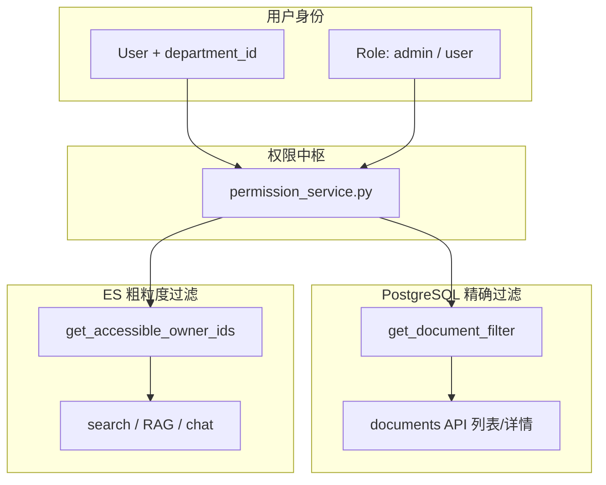

阶段 6 的核心是：**从「每人只能看自己的文档」升级到「按角色 + 部门 + 可见性控制访问」**，并补上审计、统计和异步解析能力。下面按模块说明每块代码在做什么，以及它们如何串起来。

---

## 一、整体架构：权限怎么流动



阶段 6 用了**两套权限策略**（这是理解代码的关键）：

| 场景 | 用的函数 | 过滤粒度 | 原因 |
|------|----------|----------|------|
| 文档列表 / 详情 / 下载 | `get_document_filter` | **按文档**（visibility + department） | 直接查 PostgreSQL，条件精确 |
| 搜索 / AI 问答 | `get_accessible_owner_ids` | **按 owner_id 集合** | ES 里只存了 `owner_id`，没有 visibility 字段 |

---

## 二、数据层：模型 + 迁移

### 1. `Department` / `Role` / `UserRole`

**作用：** 建立组织架构和 RBAC 基础。

- `departments`：部门表（研发部、产品部等）
- `roles`：角色表（`admin`、`user`）
- `user_roles`：用户 ↔ 角色多对多关联表

```9:18:d:\code\python\enterprise-knowledge-hub\app\models\role.py
class Role(Base):
    __tablename__ = "roles"
    id: Mapped[int] = mapped_column(primary_key=True, autoincrement=True)
    name: Mapped[str] = mapped_column(String(50), unique=True)


class UserRole(Base):
    __tablename__ = "user_roles"
    user_id: Mapped[int] = mapped_column(ForeignKey("users.id"), primary_key=True)
    role_id: Mapped[int] = mapped_column(ForeignKey("roles.id"), primary_key=True)
```

### 2. `User.department_id`

**作用：** 用户归属某个部门，用于「部门可见」文档的判断。

```20:22:d:\code\python\enterprise-knowledge-hub\app\models\user.py
    department_id: Mapped[int | None] = mapped_column(ForeignKey("departments.id"), nullable=True)
    department = relationship("Department", back_populates="users")
    roles = relationship("UserRole", back_populates="user")
```

### 3. `Document.visibility` + `Document.department_id`

**作用：** 文档访问控制的核心字段。

```16:19:d:\code\python\enterprise-knowledge-hub\app\models\document.py
class DocumentVisibility(str, Enum):
    PRIVATE = "private"       # 仅 owner 可见
    DEPARTMENT = "department"   # 同部门可见
    PUBLIC = "public"           # 全员可见
```

- `visibility`：谁可以看这篇文档
- `department_id`：当 visibility=`department` 时，指定属于哪个部门

### 4. 迁移 `f65705a152df`

**作用：** 把上述表和字段真正写入 PostgreSQL。

关键点：`visibility` 加列时用了 `server_default="private"`，避免已有文档行出现 NULL 导致迁移失败。

### 5. `SearchLog` / `AuditLog` + 迁移 `25809a1dc361`

**作用：** 支撑运营统计和安全审计。

- `search_logs`：记录「谁搜了什么、返回多少条」→ 热词统计
- `audit_logs`：记录「谁对什么资源做了什么操作」→ 上传/删除追溯

---

## 三、权限中枢：`permission_service.py`

这是阶段 6 的**大脑**，四个函数各司其职：

### `get_user_role_names` / `is_admin`

```python
# 查 user_roles 表，判断用户有没有 admin 角色
async def is_admin(db, user_id) -> bool:
    return "admin" in await get_user_role_names(db, user_id)
```

**作用：** admin  bypass 一切权限限制（看全部文档、调统计接口）。

### `get_document_filter` — 给 PostgreSQL 用

```18:30:d:\code\python\enterprise-knowledge-hub\app\services\permission_service.py
async def get_document_filter(user: User, admin: bool):
    if admin:
        return True  # 不过滤
    conditions = [
        Document.owner_id == user.id,                              # 自己的
        Document.visibility == DocumentVisibility.PUBLIC.value,  # 公开的
    ]
    if user.department_id:
        conditions.append(
            (Document.visibility == DocumentVisibility.DEPARTMENT.value)
            & (Document.department_id == user.department_id)     # 同部门
        )
    return or_(*conditions)
```

**作用：** 生成 SQLAlchemy 的 `WHERE` 条件，用于文档 API 的列表/详情/下载。

**返回值含义：**
- `True` → admin，不加任何 WHERE
- `or_(...)` → 普通用户，满足任一条件即可见

### `get_accessible_owner_ids` — 给 ES 用

```32:48:d:\code\python\enterprise-knowledge-hub\app\services\permission_service.py
async def get_accessible_owner_ids(db, user) -> list[int] | None:
    if await is_admin(db, user.id):
        return None  # ES 不加 owner 过滤
    owner_ids = {user.id}  # 始终包含自己
    # 同部门 department/public 文档的 owner
    # 全部 public 文档的 owner
    return list(owner_ids)
```

**作用：** 算出「当前用户能搜到哪些人的文档」，传给 ES 的 `terms` 过滤。

**返回值含义：**
- `None` → admin，ES 不过滤
- `[1, 3, 5]` → 只搜这些 owner_id 的 chunk

**已知局限：** 若用户 A 有 1 篇 public + 3 篇 private，B 搜到 A 的 public 文档后，A 的 owner_id 进入集合，B 的 RAG 可能也检索到 A 的 private 文档（ES 层无法区分 visibility）。这是阶段 6 的简化设计，后续可在 ES 索引里加 `visibility` 字段优化。

---

## 四、依赖注入：`deps.py`

### `get_current_admin`

```38:46:d:\code\python\enterprise-knowledge-hub\app\core\deps.py
async def get_current_admin(
    current_user: User = Depends(get_current_user),
    db: AsyncSession = Depends(get_db),
) -> User:
    if not await is_admin(db, current_user.id):
        raise HTTPException(status_code=403, detail="需要管理员权限")
    return current_user
```

**作用：** FastAPI 路由守卫。`/stats/*` 接口注入此依赖，非 admin 直接 403。

---

## 五、文档 API：`documents.py`

阶段 5 是 `Document.owner_id == current_user.id` 硬编码；阶段 6 做了这些改动：

### 上传：支持 visibility

```56:100:d:\code\python\enterprise-knowledge-hub\app\api\v1\documents.py
    visibility: str = Form("private"),
    department_id: int | None = Form(None),
    ...
    doc = Document(..., visibility=visibility, department_id=department_id, status=PENDING)
```

**作用：**
- 上传时可指定可见范围
- `department` 类型若未传 `department_id`，默认用当前用户的部门
- 状态先设为 `pending`，解析完成后再变 `ready`

### 列表：用 `get_document_filter`

不再只查 `owner_id == me`，而是查「我有权看到的所有文档」（自己的 + public + 同部门）。

### `_get_accessible_document` 辅助函数

**作用：** 详情、下载、删除、PATCH 共用同一套权限判断，避免每个接口重复写 SQL。

### 删除 / PATCH：额外 owner 校验

```python
if doc.owner_id != current_user.id and not await is_admin(...):
    raise HTTPException(403, ...)
```

**作用：** 「能看到」≠「能改/能删」。public 文档别人能看，但不能删；只有 owner 或 admin 能删/改 visibility。

### 审计日志

```python
await write_audit_log(db, current_user.id, "upload", "document", doc.id, doc.title)
await write_audit_log(db, current_user.id, "delete", "document", doc.id)
```

**作用：** 关键操作留痕，供后续审计查询。

### 异步 Worker 入队

```python
redis = await create_pool(WorkerSettings.redis_settings)
await redis.enqueue_job("parse_document_task", doc.id)
```

**作用：** 把 PDF 解析、分块、ES 索引放到后台 Worker，避免上传接口阻塞。

> 注意：当前代码里**同步** `process_document` 和 **异步**入队同时存在，等于可能解析两次。若 Worker 也在跑，建议上传里只保留入队，去掉同步那行。

---

## 六、搜索 & RAG：多 owner 权限链

### 调用链

```
search.py / chat.py
  → get_accessible_owner_ids(db, user)     # 算可见 owner 集合
  → search_service / rag_graph / chat_service
  → es_client.search_documents / retrieve_chunks
  → ES terms filter: owner_id in [...]
```

### `search.py`

```22:28:d:\code\python\enterprise-knowledge-hub\app\api\v1\search.py
    owner_ids = await get_accessible_owner_ids(db, current_user)
    result = do_search(q, owner_ids, page, page_size)
    db.add(SearchLog(user_id=current_user.id, query=q, result_count=result.total))
```

**作用：** 搜索前先算权限，搜完写 `SearchLog` 供热词统计。

### `search_service.py`

参数从 `owner_id: int` 改为 `owner_ids: list[int] | None`，透传给 ES。

### `rag_graph.py` + `chat_service.py`

RAG 检索同样传 `owner_ids`，让 AI 问答能引用 public/部门文档，而不只是用户自己上传的。

### `es_client.py`

```67:68:d:\code\python\enterprise-knowledge-hub\app\infra\es_client.py
    if owner_ids is not None:
        bool_query["filter"] = [{"terms": {"owner_id": owner_ids}}]
```

**作用：** `None` = admin 不加 filter；有值 = 只搜这些 owner 的 chunk。

---

## 七、审计 & 统计

### `audit_service.py`

封装 `write_audit_log()`，统一写 `audit_logs` 表，避免 API 层直接操作模型。

### `stats_service.py`

| 函数 | 作用 |
|------|------|
| `get_overview` | 统计用户数、文档数、问答数、搜索次数 |
| `get_hotwords` | 从 `search_logs` 按 query 分组，取 Top 10 热词 |

### `stats.py` API

```python
@router.get("/overview")
async def stats_overview(_: User = Depends(get_current_admin), ...):
```

**作用：** 管理员仪表盘数据，普通用户访问返回 403。

---

## 八、异步 Worker

### `workers/tasks.py` — `parse_document_task`

```python
async def parse_document_task(ctx, document_id):
    # 独立 DB session
    # 调用 process_document → 解析 / 分块 / 写 ES
    # 失败则 doc.status = "failed"
```

**作用：** 后台执行耗时的文档处理，与 FastAPI 主进程解耦。

### `workers/settings.py`

注册 arq 的 Redis 连接和任务函数，启动命令：

```bash
arq app.workers.settings.WorkerSettings
```

---

## 九、Seed 脚本：`scripts/seed_rbac.py`

**作用：** 初始化演示/测试数据，否则 RBAC 表是空的，`is_admin()` 永远为 false。

创建内容：
- 3 个部门：研发部、产品部、人事部
- 2 个角色：admin、user
- 管理员账号：`admin / admin123`，绑定 admin 角色 + 研发部

---

## 十、Schemas 变化：`schemas/document.py`

响应里多了 `visibility`、`department_id`；新增 `DocumentUpdateRequest` 供 PATCH 改可见性。API 和前端能展示/修改文档的访问范围。

---

## 十一、各模块协作示例

**场景：研发部用户 B 搜索「报销流程」**

1. B 登录，token 解析出 `user_id=2, department_id=1`
2. `GET /search?q=报销流程`
3. `is_admin(2)` → false
4. `get_accessible_owner_ids` → `[2, 5, 7]`（B 自己 + 发过 public/部门文档的用户）
5. ES 只搜 `owner_id in [2,5,7]` 的 chunk
6. 写入 `search_logs(query="报销流程", result_count=3)`
7. 返回 3 条结果

**场景：用户 A 上传部门可见文档**

1. `POST /documents`，`visibility=department`
2. 未传 `department_id` → 用 A 的 `department_id`
3. 写 MinIO + PostgreSQL（status=pending）
4. 入队 `parse_document_task`
5. Worker 解析 → 分块 → 索引 ES（带 A 的 owner_id）
6. 写 `audit_logs(action=upload)`
7. 同部门其他人能在列表/搜索/RAG 里看到

---

## 十二、阶段 6 相对阶段 5 的能力对比

| 能力 | 阶段 5 | 阶段 6 |
|------|--------|--------|
| 文档隔离 | 仅 owner | private / department / public |
| 角色 | 无 | admin / user |
| 部门 | 无 | 部门归属 + 部门文档 |
| 搜索范围 | 仅自己的 | 有权限的所有文档 |
| AI 问答引用 | 仅自己的 | 有权限的所有文档 |
| 操作审计 | 无 | upload / delete 留痕 |
| 运营统计 | 无 | 概览 + 搜索热词 |
| 文档解析 | 同步阻塞 | 支持 arq 异步（已接入） |

---

## 一个小提醒

`rag_graph.py` 第 80 行目前是：

```python
result = rag_graph.invoke({"question": question, "owner_id": owner_ids})
```

而 `retrieve_node` 读的是 `state["owner_ids"]`，键名不一致。若 AI 问答报 `KeyError`，改成 `"owner_ids": owner_ids` 即可。搜索接口不受影响，因为它不经过 RAG graph。

---

如果你想深入某一块（比如「为什么 ES 用 owner_ids 而不是 document_id」或「怎么改成 document 级精确过滤」），可以说一下，我可以单独展开。