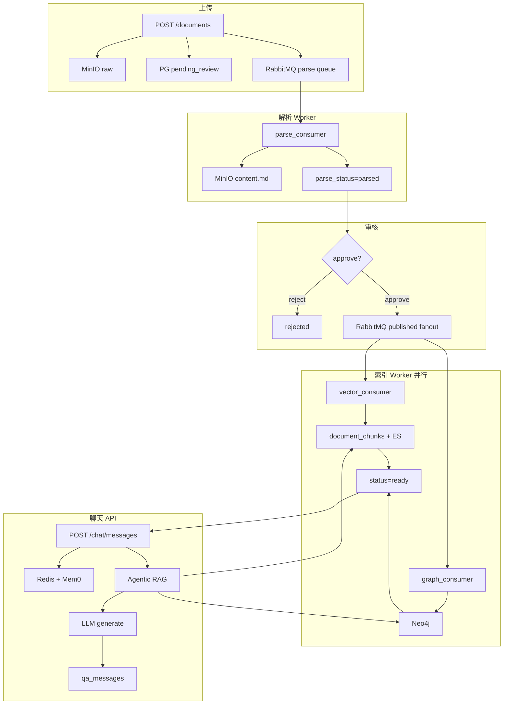

下面是从 **上传文件 → 入库可被 Chat 检索 → 生成回答** 的完整梳理，包含主要分支和失败路径。

---

# 一、总览：两条大流水线

```text
┌─────────────────────────────────────────────────────────────┐
│  文档流水线（异步 Worker）                                      │
│  上传 → 解析 → 审核 → 向量索引 + 图谱 → status=ready           │
└─────────────────────────────────────────────────────────────┘
                              ↓ 只有 ready 文档能进 RAG
┌─────────────────────────────────────────────────────────────┐
│  问答流水线（API 同步/流式）                                    │
│  鉴权 → 记忆 → Agentic RAG → LLM → 落库 → 更新记忆            │
└─────────────────────────────────────────────────────────────┘
```

**需要跑的服务：**

| 服务 | 作用 |
|------|------|
| API (`uvicorn`) | HTTP |
| `parse_consumer` light/heavy | 解析 |
| `vector_consumer` | 分块 + 向量 + ES |
| `graph_consumer` | Neo4j 实体 |
| Docker | PG、Redis、MinIO、ES、Neo4j、RabbitMQ |

---

# 二、文档状态机

文档有两个独立维度：

**业务状态 `status`：**

```text
pending_review → (审核)
    ├─ reject → rejected（结束）
    └─ approve → published → processing → ready
                              └─ 索引失败 → 仍 processing（metadata 记错）
```

**解析状态 `parse_status`：**

```text
pending → parsing → parsed
                 └→ failed
```

只有 **`parse_status=parsed` 且审核 approve** 后才会走向量/图谱；Chat 只检索 **`status=ready`** 的文档。

---

# 三、阶段 1：上传

**入口：** `POST /api/v1/documents`（multipart `file`）

```text
校验扩展名 / 大小
  → 原始文件 upload MinIO（minio_key）
  → PG 插入 documents
       status = pending_review
       parse_status = pending
  → RabbitMQ publish_document_uploaded
  → HTTP 立即返回（不等解析）
```

**MQ 路由：**

| 文件类型 | 队列 |
|----------|------|
| pdf, docx, txt, md, 图片, csv, xlsx | **light** |
| mp3, wav, m4a, mp4, mov 等 | **heavy** |

---

# 四、阶段 2：解析（parse_consumer）

**消费：** `document.parse.light.queue` / `document.parse.heavy.queue`

```text
读 PG documents
  → parse_status = parsing
  → MinIO 下载 raw
  → parse_to_markdown（按后缀选 Parser）
  → 上传 MinIO parsed/content.md
  → PG 更新：
       parse_status = parsed
       parsed_markdown_key = ...
       parse_metadata = {parser, progress...}
```

### 按文件类型的解析分支

| 类型 | Parser | 产出 |
|------|--------|------|
| PDF | PdfParser | 文本 + 内嵌图 OCR + 图 URL |
| Word | DocxParser | 同上 |
| txt/md | TextParser | 原文 Markdown |
| 图片 | ImageParser | OCR（部分待完善） |
| 音频 | AudioParser | ASR → 转写文本 |
| 视频 | VideoParser | 分片 + 抽帧理解 + 音轨 ASR |
| csv/xlsx | SpreadsheetParser | 表格 → Markdown |

**失败：** `parse_status=failed`，`parse_error` 有原因；**不会**自动进索引。

**成功之后：** 文档仍是 `pending_review`，等人工审核。

**可选 API：**

- `GET /documents/{id}/parsed` — 预览 Markdown  
- `POST /documents/{id}/reparse` — 重跑解析（会回到 pending_review，清 vector/graph 标记）

---

# 五、阶段 3：审核

**入口：** `POST /api/v1/review/{doc_id}`，`action=approve|reject`

### 路径 A：拒绝

```text
status → rejected
不投 MQ，不进索引，Chat 搜不到
```

### 路径 B：通过

```text
校验 parse_status=parsed + parsed_markdown_key 存在
  → vector_done=false, graph_done=false
  → RabbitMQ fanout publish_document_published
  → status = processing
```

**同时** fanout 到两个队列（并行）：

- `document.vector.queue`
- `document.graph.queue`

---

# 六、阶段 4a：向量索引（vector_consumer）

```text
读 MinIO parsed/content.md（不再解析 raw）
  → split_text 分块
  → embed 批量向量化
  → PG document_chunks（embedding vector(1024)）
  → ES 索引 BM25
  → vector_done = true
  → 若 graph_done 也为 true → status = ready
```

**表：**

- `document_chunks` — RAG 用的 pgvector  
- Elasticsearch — BM25 关键词

---

# 六、阶段 4b：图谱（graph_consumer）

```text
等 PG 里有 chunks（重试）
  → 每个 chunk LLM 抽实体/关系
  → 写入 Neo4j（Document, Entity, MENTIONS, RELATES_TO）
  → graph_done = true
  → 若 vector_done 也为 true → status = ready
```

图谱用于 **Agentic RAG 复杂题** 的 `graph_node` 多跳推理，不是每条问题都查。

---

# 七、文档「可被 Chat 用到」的条件

```text
status = ready
  + document_chunks 有 embedding
  + ES 有对应 chunk
  + 当前用户有权限（owner / 部门 / public / admin）
```

权限过滤在 `get_accessible_owner_ids()`：非 admin 只能搜 **ready** 且可见范围内的 `owner_id`。

---

# 八、阶段 5：聊天

## 8.1 创建会话

```text
POST /api/v1/chat/sessions
  → PG qa_sessions
```

## 8.2 非流式问答

**入口：** `POST /api/v1/chat/sessions/{id}/messages`

```text
① JWT 鉴权
② get_accessible_owner_ids()  → 数据权限
③ save_message(user)
④ build_memory_context()
     Redis 短记忆（空则 PG 回填）
     Mem0 长期（mem0_enabled=true 时）
⑤ run_agentic_rag()  ← LangGraph
⑥ save_message(assistant) + citations
⑦ Redis append + maybe_summarize
⑧ 异步 Mem0 add
```

## 8.3 流式问答

**入口：** `POST /api/v1/chat/sessions/{id}/messages/stream`

与非流式 **检索逻辑相同**（`run_agentic_retrieve`），区别是 LLM **流式**输出 SSE。

---

# 九、Agentic RAG 分支（每种问题走不同路）

```text
analyze（LLM 判意图/复杂度）
  │
  ├─ direct（寒暄）────────────→ generate（不检索文档）
  │
  ├─ hybrid_only（简单事实）───→ hybrid(BM25+向量) → merge → generate
  │
  ├─ rewrite + hybrid（指代/复杂）→ rewrite → hybrid → merge → generate
  │
  └─ rewrite + hybrid + graph（关系/多跳）
        → rewrite → hybrid → graph(Neo4j) → generate
```

| 问题示例 | 典型路径 |
|----------|----------|
| 「你好」 | direct |
| 「报销上限多少」 | hybrid |
| 「刚才说的第二步是什么」 | rewrite → hybrid |
| 「张三和李四部门负责哪些制度」 | rewrite → hybrid → graph |

**检索细节：**

- **hybrid**：ES(BM25) + PG(pgvector) → RRF → Rerank  
- **graph**：Neo4j 多跳推理链 + 关联 chunk（仅 `needs_graph=true`）  
- **不再**在 hybrid 里重复查 Neo4j 第三路

---

# 十、记忆在问答里的位置

```text
拼 prompt 顺序：
  Mem0 用户长期记忆
  Mem0 本会话记忆
  Redis 对话摘要
  Redis 最近 8 轮
  RAG 参考资料（文档 chunk）
  当前问题
```

| 存储 | 读 | 写 |
|------|----|----|
| Redis | 每问前 | 每答后 |
| Mem0 | 每问前 search | 每答后 async add |
| PG qa_messages | Redis 空时回填 | 每问/每答 |

---

# 十一、端到端 happy path（PDF 为例）

```text
1. 用户上传 report.pdf
2. MinIO raw + PG pending_review/pending
3. parse_consumer: PDF→Markdown→MinIO parsed/
4. parse_status=parsed，仍 pending_review
5. 管理员 approve
6. vector_consumer: chunks + ES + pgvector
7. graph_consumer: Neo4j 实体
8. status=ready
9. 用户 POST /chat/.../messages 「报告里第三章说什么？」
10. Agentic: analyze→hybrid→检索 report chunk→generate
11. 返回答案 + citations
```

---

# 十二、常见异常 / 分支流程

| 场景 | 发生什么 |
|------|----------|
| parse worker 没起 | parse_status 一直 pending，审核会报错 |
| 解析失败 | parse_status=failed，不能 approve |
| 审核 reject | rejected，永不索引 |
| vector 失败 | processing，`parse_metadata.vector_error`；graph 仍可能成功 |
| graph 失败 | processing，`graph_error`；vector 成功则 chunks 仍可用 |
| 只开 API 不开 worker | 上传成功但永远不 ready |
| Mem0 未开 | 只有 Redis 短记忆，无长期记忆 |
| 文档未 ready | RAG 无 chunk，可能只靠记忆回答或提示无资料 |
| reparse | 回 pending_review，需重新 approve 才 reindex |
| 删文档 | 删 MinIO raw/parsed、ES、Neo4j、chunks、PG 记录 |

---

# 十三、数据落在哪些组件（速查）

| 数据 | 位置 |
|------|------|
| 原始文件 | MinIO `minio_key` |
| 解析 Markdown | MinIO `parsed_markdown_key` |
| 文档元数据 | PG `documents` |
| RAG 向量 | PG `document_chunks.embedding` |
| RAG 关键词 | Elasticsearch |
| 知识图谱 | Neo4j |
| 聊天原文 | PG `qa_messages` |
| 短记忆 | Redis |
| Mem0 事实 | PG `mem0_memories`（开启且 add 过后才有表） |

---

# 十四、一张总流程图



---

如果你希望，我可以再单独画一张 **「仅多媒体（视频/音频）」** 或 **「仅 Agentic 四条路由」** 的细化图，或者按 **API 列表 + 对应 Worker** 做成启动检查清单。