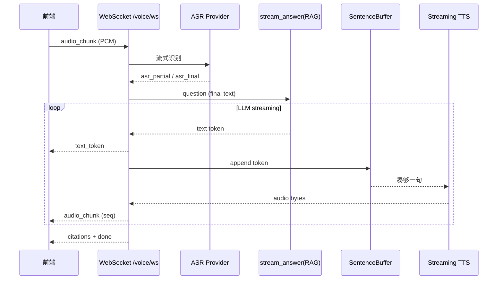

# 语音交互设计方案（ASR + 流式 TTS + SSE + WebSocket）

基于你现有 Chat 链路（**RAG 检索 → LLM 流式 → SSE `token/done`**），建议做成 **双通道、一套 RAG 核心**：

| 模式 | 输入 | 文字输出 | 语音输出 |
|------|------|----------|----------|
| **文字模式** | 文本 | SSE（已有） | 无 |
| **语音模式** | 麦克风音频 | WebSocket `text_token` | WebSocket `audio_chunk` 流式播放 |

---

## 1. 总体架构



**关键点**：
- **SSE** 继续服务纯文字 Chat（现有 `/messages/stream` 不动）
- **WebSocket** 专供语音：上行音频、下行「文字 token + 音频 chunk」同步
- **TTS 不能逐字合成**，需要 `SentenceBuffer` 把 LLM token 攒成句子再送 TTS

---

## 2. 目录结构（新增）

```text
app/voice/
├── __init__.py
├── schemas.py              # WS 消息协议
├── sentence_buffer.py      # token → 句子切分
├── pipeline.py             # 语音会话编排（ASR→RAG→TTS）
└── providers/
    ├── asr.py              # 语音识别（DashScope Paraformer）
    └── tts.py              # 流式 TTS（DashScope CosyVoice）

app/api/v1/
├── chat.py                 # 现有 SSE 不动
└── voice_ws.py             # WebSocket 入口
```

`main.py` 注册：

```python
from app.api.v1.voice_ws import router as voice_ws_router
app.include_router(voice_ws_router, prefix="/api/v1")
```

---

## 3. 配置 `settings.py`

```python
# 语音交互
voice_enabled: bool = True
asr_model: str = "paraformer-realtime-v2"       # DashScope 实时 ASR
asr_sample_rate: int = 16000
asr_format: str = "pcm"                           # pcm / wav

tts_model: str = "cosyvoice-v1"                   # DashScope 流式 TTS
tts_voice: str = "longxiaochun"                   # 音色
tts_format: str = "mp3"                           # mp3 / pcm
tts_sample_rate: int = 22050

# 句子缓冲：LLM 攒多少字再送 TTS
tts_min_chars: int = 12
tts_flush_delimiters: str = "。！？；\n.!?"

# WS
ws_max_audio_chunk_bytes: int = 64 * 1024
ws_heartbeat_seconds: int = 30
```

`.env` 示例：

```env
VOICE_ENABLED=true
ASR_MODEL=paraformer-realtime-v2
TTS_MODEL=cosyvoice-v1
TTS_VOICE=longxiaochun
```

---

## 4. WebSocket 协议设计

### 4.1 客户端 → 服务端

```json
// 1. 建立会话（首包，JWT 已在 query ?token=xxx）
{"type": "start", "session_id": 1}

// 2. 发送音频片段（录音 PCM/WAV base64）
{"type": "audio", "data": "<base64>", "format": "pcm", "sample_rate": 16000, "seq": 1}

// 3. 结束说话，触发 final ASR
{"type": "audio_end"}

// 4. 打断当前回答（停止 TTS + LLM）
{"type": "cancel"}

// 5. 纯文字兜底（可选，不走 ASR）
{"type": "text", "question": "公司请假流程是什么？"}
```

### 4.2 服务端 → 客户端

```json
{"type": "asr_partial", "text": "公司请假"}
{"type": "asr_final", "text": "公司请假流程是什么？"}

{"type": "text_token", "content": "根据"}
{"type": "text_token", "content": "手册"}

{"type": "audio_chunk", "seq": 1, "format": "mp3", "data": "<base64>", "text": "根据手册，"}
{"type": "audio_chunk", "seq": 2, "format": "mp3", "data": "<base64>", "text": "年假为10天。"}

{"type": "citations", "citations": [{"document_id": 1, "title": "..."}]}
{"type": "done", "full_answer": "根据手册，年假为10天。"}
{"type": "error", "message": "ASR 失败"}
```

---

## 5. 协议 Schema

```python
# app/voice/schemas.py

from typing import Any, Literal
from pydantic import BaseModel, Field

class WSClientMessage(BaseModel):
    type: Literal["start", "audio", "audio_end", "cancel", "text", "ping"]
    session_id: int | None = None
    data: str | None = None           # base64 audio
    format: str | None = "pcm"
    sample_rate: int | None = 16000
    seq: int | None = None
    question: str | None = None

class WSServerMessage(BaseModel):
    type: Literal[
        "asr_partial", "asr_final",
        "text_token", "audio_chunk",
        "citations", "done", "error", "pong"
    ]
    text: str | None = None
    content: str | None = None
    data: str | None = None           # base64 audio
    format: str | None = None
    seq: int | None = None
    citations: list[dict[str, Any]] | None = None
    full_answer: str | None = None
    message: str | None = None
```

---

## 6. 句子缓冲器（LLM token → TTS 输入）

```python
# app/voice/sentence_buffer.py

from app.core.settings import settings

class SentenceBuffer:
    """把 LLM 流式 token 切成适合 TTS 的句子"""

    def __init__(self) -> None:
        self._buf = ""
        self._delimiters = set(settings.tts_flush_delimiters)

    def push(self, token: str) -> list[str]:
        """追加 token，返回可送 TTS 的句子列表"""
        if not token:
            return []

        self._buf += token
        sentences: list[str] = []

        while True:
            # 找最早出现的分隔符
            cut_idx = -1
            for i, ch in enumerate(self._buf):
                if ch in self._delimiters:
                    cut_idx = i
                    break

            if cut_idx >= 0 and cut_idx + 1 >= settings.tts_min_chars:
                sentence = self._buf[: cut_idx + 1].strip()
                self._buf = self._buf[cut_idx + 1 :]
                if sentence:
                    sentences.append(sentence)
                continue

            # 超长强制切（避免 TTS 一直等不到标点）
            if len(self._buf) >= settings.tts_min_chars * 4:
                sentence = self._buf.strip()
                self._buf = ""
                if sentence:
                    sentences.append(sentence)
                continue

            break

        return sentences

    def flush(self) -> str | None:
        """流结束时 flush 剩余"""
        rest = self._buf.strip()
        self._buf = ""
        return rest or None
```

---

## 7. ASR Provider（DashScope 实时识别）

```python
# app/voice/providers/asr.py

import asyncio
import base64
import json
from dataclasses import dataclass, field

import websockets

from app.core.settings import settings


@dataclass
class AsrEvent:
    kind: str          # partial | final
    text: str


@dataclass
class StreamingAsrSession:
    """一次「说话→识别」的会话"""
    _queue: asyncio.Queue[AsrEvent] = field(default_factory=asyncio.Queue)
    _ws: websockets.WebSocketClientProtocol | None = None
    _task: asyncio.Task | None = None

    async def start(self) -> None:
        url = (
            "wss://dashscope.aliyuncs.com/api-ws/v1/inference"
            f"?model={settings.asr_model}"
        )
        headers = {"Authorization": f"Bearer {settings.openai_api_key}"}
        self._ws = await websockets.connect(url, additional_headers=headers)
        # 发送 start 帧（示意，以 DashScope 文档为准）
        await self._ws.send(json.dumps({
            "header": {"action": "run-task"},
            "payload": {
                "task_group": "audio",
                "task": "asr",
                "function": "recognition",
                "model": settings.asr_model,
                "parameters": {
                    "format": settings.asr_format,
                    "sample_rate": settings.asr_sample_rate,
                },
            },
        }))
        self._task = asyncio.create_task(self._recv_loop())

    async def _recv_loop(self) -> None:
        assert self._ws
        async for msg in self._ws:
            data = json.loads(msg)
            text = data.get("payload", {}).get("output", {}).get("sentence", {}).get("text", "")
            if not text:
                continue
            is_final = data.get("payload", {}).get("output", {}).get("sentence", {}).get("end_time") is not None
            await self._queue.put(AsrEvent("final" if is_final else "partial", text))

    async def feed_audio(self, pcm_bytes: bytes) -> None:
        assert self._ws
        await self._ws.send(pcm_bytes)  # 或 base64 二进制帧，按 API 规范

    async def finish(self) -> str:
        """结束音频输入，等待 final"""
        assert self._ws
        await self._ws.send(json.dumps({"header": {"action": "finish-task"}}))
        final_text = ""
        while True:
            ev = await self._queue.get()
            if ev.kind == "final":
                final_text = ev.text
                break
        await self.close()
        return final_text

    async def events(self):
        while not self._queue.empty():
            yield await self._queue.get()

    async def close(self) -> None:
        if self._task:
            self._task.cancel()
        if self._ws:
            await self._ws.close()
```

**简化版（非实时）**：前端录完一整段 WAV → HTTP POST `/voice/asr` → 一次性返回文本，WS 里跳过 streaming ASR。

```python
# app/voice/providers/asr_batch.py

import httpx
from app.core.settings import settings

async def transcribe_bytes(audio_bytes: bytes, file_name: str = "input.wav") -> str:
    """文件 ASR（Paraformer 异步/同步 API）"""
    url = "https://dashscope.aliyuncs.com/api/v1/services/audio/asr/transcription"
    # 1. 上传 audio 到临时存储或 base64
    # 2. 提交任务，轮询结果
    async with httpx.AsyncClient(timeout=120) as client:
        resp = await client.post(
            url,
            headers={"Authorization": f"Bearer {settings.openai_api_key}"},
            json={"model": settings.asr_model, "file_urls": ["..."]},
        )
        resp.raise_for_status()
        return resp.json()["output"]["text"]
```

---

## 8. 流式 TTS Provider

```python
# app/voice/providers/tts.py

import base64
from collections.abc import AsyncGenerator

import httpx

from app.core.settings import settings


async def synthesize_stream(text: str) -> AsyncGenerator[bytes, None]:
    """
    流式 TTS：输入一句文本，yield 多段 mp3/pcm bytes
    DashScope CosyVoice streaming（示意）
    """
    url = "https://dashscope.aliyuncs.com/api/v1/services/aigc/text-to-speech/stream"
    payload = {
        "model": settings.tts_model,
        "input": {"text": text},
        "parameters": {
            "voice": settings.tts_voice,
            "format": settings.tts_format,
            "sample_rate": settings.tts_sample_rate,
        },
    }

    async with httpx.AsyncClient(timeout=60) as client:
        async with client.stream(
            "POST",
            url,
            headers={
                "Authorization": f"Bearer {settings.openai_api_key}",
                "X-DashScope-SSE": "enable",
            },
            json=payload,
        ) as resp:
            resp.raise_for_status()
            async for line in resp.aiter_lines():
                if not line or not line.startswith("data:"):
                    continue
                chunk = line[5:].strip()
                if chunk == "[DONE]":
                    break
                # 解析 JSON，取 audio base64 → decode
                import json
                data = json.loads(chunk)
                audio_b64 = data.get("output", {}).get("audio", "")
                if audio_b64:
                    yield base64.b64decode(audio_b64)
```

---

## 9. 语音 Pipeline（复用现有 `stream_answer` 逻辑）

```python
# app/voice/pipeline.py

import asyncio
import base64
import json
from collections.abc import AsyncGenerator

from app.services.chat_service import build_memory_context, chunks_to_citations
from app.ai.retrievers.hybrid_retriever import hybrid_retrieve
from app.ai.memory.prompt import SYSTEM_PROMPT, build_user_prompt
from app.core.settings import settings
from app.infra.db import AsyncSessionLocal
from app.voice.sentence_buffer import SentenceBuffer
from app.voice.providers.tts import synthesize_stream
from app.voice.schemas import WSServerMessage

from langchain_core.messages import HumanMessage, SystemMessage
from langchain_openai import ChatOpenAI


async def stream_voice_answer(
    *,
    question: str,
    owner_ids: list[int] | None,
    user_id: int,
    session_id: int,
) -> AsyncGenerator[WSServerMessage, None]:
    """
    核心：LLM 流式 → 同时输出 text_token + audio_chunk
    """
    memory = await build_memory_context(user_id, session_id, question)

    async with AsyncSessionLocal() as db:
        hits = await hybrid_retrieve(db, question, owner_ids, settings.rag_top_k)
    chunks = [h.to_dict() for h in hits]

    if not chunks and not memory.has_content():
        fallback = "未找到相关文档，请先上传资料后再提问。"
        yield WSServerMessage(type="text_token", content=fallback)
        async for audio in synthesize_stream(fallback):
            yield WSServerMessage(
                type="audio_chunk",
                seq=1,
                format=settings.tts_format,
                data=base64.b64encode(audio).decode(),
                text=fallback,
            )
        yield WSServerMessage(type="done", full_answer=fallback, citations=[])
        return

    parts = [f"[{i}] 文档《{c['title']}》\n{c['content']}" for i, c in enumerate(chunks, 1)]
    user_prompt = build_user_prompt(question=question, rag_context="\n\n".join(parts), memory=memory)
    citations = [c.model_dump() for c in chunks_to_citations(chunks)]

    llm = ChatOpenAI(
        model=settings.openai_model,
        api_key=settings.openai_api_key,
        base_url=settings.openai_base_url,
        temperature=0.2,
        streaming=True,
    )
    messages = [SystemMessage(content=SYSTEM_PROMPT), HumanMessage(content=user_prompt)]

    buf = SentenceBuffer()
    full_answer: list[str] = []
    audio_seq = 0
    cancel_event = asyncio.Event()  # 由 WS handler 注入

    async for chunk in llm.astream(messages):
        if cancel_event.is_set():
            break
        token = chunk.content or ""
        if not token:
            continue

        full_answer.append(token)
        yield WSServerMessage(type="text_token", content=token)

        for sentence in buf.push(token):
            audio_seq += 1
            seq = audio_seq
            async for audio_bytes in synthesize_stream(sentence):
                if cancel_event.is_set():
                    break
                yield WSServerMessage(
                    type="audio_chunk",
                    seq=seq,
                    format=settings.tts_format,
                    data=base64.b64encode(audio_bytes).decode(),
                    text=sentence,
                )

    # flush 剩余
    rest = buf.flush()
    if rest and not cancel_event.is_set():
        audio_seq += 1
        async for audio_bytes in synthesize_stream(rest):
            yield WSServerMessage(
                type="audio_chunk",
                seq=audio_seq,
                format=settings.tts_format,
                data=base64.b64encode(audio_bytes).decode(),
                text=rest,
            )

    yield WSServerMessage(
        type="citations",
        citations=citations,
    )
    yield WSServerMessage(
        type="done",
        full_answer="".join(full_answer),
    )
```

---

## 10. WebSocket 入口

```python
# app/api/v1/voice_ws.py

import base64
import json
import logging

from fastapi import APIRouter, WebSocket, WebSocketDisconnect, status
from jose import JWTError

from app.core.security import decode_access_token
from app.infra.db import AsyncSessionLocal
from app.services.chat_service import (
    build_memory_context,
    get_user_session,
    save_message,
    _after_message_persisted,
)
from app.services.permission_service import get_accessible_owner_ids
from app.schemas.chat import Citation
from app.voice.pipeline import stream_voice_answer
from app.voice.providers.asr import StreamingAsrSession
from app.voice.schemas import WSClientMessage, WSServerMessage

logger = logging.getLogger(__name__)
router = APIRouter()


async def _authenticate_ws(websocket: WebSocket) -> int | None:
    token = websocket.query_params.get("token")
    if not token:
        return None
    try:
        payload = decode_access_token(token)
        return int(payload.get("sub"))
    except (JWTError, TypeError, ValueError):
        return None


@router.websocket("/voice/ws")
async def voice_chat_ws(websocket: WebSocket):
    await websocket.accept()

    user_id = await _authenticate_ws(websocket)
    if user_id is None:
        await websocket.close(code=status.WS_1008_POLICY_VIOLATION)
        return

    asr_session: StreamingAsrSession | None = None
    session_id: int | None = None
    owner_ids: list[int] | None = None

    try:
        while True:
            raw = await websocket.receive_text()
            msg = WSClientMessage.model_validate_json(raw)

            if msg.type == "ping":
                await websocket.send_json(WSServerMessage(type="pong").model_dump())
                continue

            if msg.type == "start":
                session_id = msg.session_id
                async with AsyncSessionLocal() as db:
                    from app.models.user import User
                    user = await db.get(User, user_id)
                    sess = await get_user_session(db, session_id, user_id)
                    if sess is None:
                        await websocket.send_json(
                            WSServerMessage(type="error", message="会话不存在").model_dump()
                        )
                        continue
                    owner_ids = await get_accessible_owner_ids(db, user)
                asr_session = StreamingAsrSession()
                await asr_session.start()
                continue

            if msg.type == "audio" and asr_session and msg.data:
                pcm = base64.b64decode(msg.data)
                await asr_session.feed_audio(pcm)
                # 推送 partial（可从 asr_session.events 读）
                continue

            if msg.type == "audio_end" and asr_session and session_id is not None:
                question = await asr_session.finish()
                asr_session = None

                await websocket.send_json(
                    WSServerMessage(type="asr_final", text=question).model_dump()
                )

                async with AsyncSessionLocal() as db:
                    sess = await get_user_session(db, session_id, user_id)
                    await save_message(db, session_id, "user", question)
                    await db.commit()

                full_answer_parts: list[str] = []
                citations_data: list[dict] = []

                async for event in stream_voice_answer(
                    question=question,
                    owner_ids=owner_ids,
                    user_id=user_id,
                    session_id=session_id,
                ):
                    await websocket.send_json(event.model_dump())
                    if event.type == "text_token" and event.content:
                        full_answer_parts.append(event.content)
                    if event.type == "citations":
                        citations_data = event.citations or []
                    if event.type == "done" and event.full_answer:
                        full_answer_parts = [event.full_answer]

                answer_text = "".join(full_answer_parts)
                async with AsyncSessionLocal() as db:
                    citations = [Citation(**c) for c in citations_data]
                    await save_message(db, session_id, "assistant", answer_text, citations)
                    await _after_message_persisted(
                        user_id=user_id,
                        session_id=session_id,
                        question=question,
                        answer=answer_text,
                    )
                    await db.commit()
                continue

            if msg.type == "text" and msg.question and session_id is not None:
                # 文字兜底：WS 模式也能打字
                question = msg.question
                async with AsyncSessionLocal() as db:
                    await save_message(db, session_id, "user", question)
                    await db.commit()

                async for event in stream_voice_answer(
                    question=question,
                    owner_ids=owner_ids,
                    user_id=user_id,
                    session_id=session_id,
                ):
                    await websocket.send_json(event.model_dump())
                continue

            if msg.type == "cancel":
                # 打断：设置 cancel_event（需在 pipeline 里暴露）
                continue

    except WebSocketDisconnect:
        logger.info("voice ws disconnected user=%s", user_id)
    finally:
        if asr_session:
            await asr_session.close()
```

---

## 11. 现有 SSE 文字流（保持不变，对照）

你已有实现，协议如下：

```http
POST /api/v1/chat/sessions/{session_id}/messages/stream
Authorization: Bearer <token>
Content-Type: application/json

{"question": "公司请假流程是什么？"}
```

响应 `text/event-stream`：

```text
data: {"type":"token","content":"根据"}

data: {"type":"token","content":"手册"}

data: {"type":"done","citations":[{"document_id":1,"title":"员工手册",...}]}
```

前端：

```typescript
// 前端 SSE 消费（文字模式）
const es = await fetch(`/api/v1/chat/sessions/${sessionId}/messages/stream`, {
  method: "POST",
  headers: {
    Authorization: `Bearer ${token}`,
    "Content-Type": "application/json",
  },
  body: JSON.stringify({ question }),
});

const reader = es.body!.getReader();
const decoder = new TextDecoder();

while (true) {
  const { done, value } = await reader.read();
  if (done) break;
  const chunk = decoder.decode(value);
  for (const line of chunk.split("\n")) {
    if (!line.startsWith("data: ")) continue;
    const payload = JSON.parse(line.slice(6));
    if (payload.type === "token") appendText(payload.content);
    if (payload.type === "done") setCitations(payload.citations);
  }
}
```

---

## 12. 前端 WebSocket + 流式播放（关键）

```typescript
// 前端语音模式
class VoiceChatClient {
  private ws: WebSocket;
  private audioQueue: ArrayBuffer[] = [];
  private isPlaying = false;
  private audioCtx = new AudioContext();

  connect(sessionId: number, token: string) {
    this.ws = new WebSocket(
      `ws://127.0.0.1:8000/api/v1/voice/ws?token=${token}`
    );
    this.ws.onopen = () => {
      this.ws.send(JSON.stringify({ type: "start", session_id: sessionId }));
    };
    this.ws.onmessage = (ev) => this.handleMessage(JSON.parse(ev.data));
  }

  sendAudioChunk(pcmBase64: string, seq: number) {
    this.ws.send(JSON.stringify({
      type: "audio",
      data: pcmBase64,
      format: "pcm",
      sample_rate: 16000,
      seq,
    }));
  }

  endSpeaking() {
    this.ws.send(JSON.stringify({ type: "audio_end" }));
  }

  private handleMessage(msg: any) {
    switch (msg.type) {
      case "asr_partial":
        showPartialText(msg.text);
        break;
      case "asr_final":
        showUserText(msg.text);
        break;
      case "text_token":
        appendAssistantText(msg.content);   // 字幕同步显示
        break;
      case "audio_chunk":
        this.enqueueAudio(msg.data, msg.format);
        break;
      case "done":
        finishTurn(msg.full_answer);
        break;
    }
  }

  private async enqueueAudio(base64: string, format: string) {
    const bytes = Uint8Array.from(atob(base64), (c) => c.charCodeAt(0));
    // mp3 需 decodeAudioData；pcm 需手动建 AudioBuffer
    const buffer = await this.audioCtx.decodeAudioData(bytes.buffer.slice(0));
    this.audioQueue.push(buffer);
    if (!this.isPlaying) this.playNext();
  }

  private async playNext() {
    if (this.audioQueue.length === 0) {
      this.isPlaying = false;
      return;
    }
    this.isPlaying = true;
    const buffer = this.audioQueue.shift()!;
    const source = this.audioCtx.createBufferSource();
    source.buffer = buffer;
    source.connect(this.audioCtx.destination);
    source.onended = () => this.playNext();
    source.start();
  }
}
```

**同步播放要点**：
- 按 `seq` 顺序入队（同一句可能多个 `audio_chunk`）
- `text_token` 立即渲染字幕；`audio_chunk` 排队播放
- 用户说 `cancel` 时：`source.stop()` + 清空 `audioQueue` + 后端打断 LLM

---

## 13. 可选：HTTP ASR 上传（录音文件）

```python
# app/api/v1/voice_http.py

from fastapi import APIRouter, Depends, File, UploadFile
from app.core.deps import get_current_user
from app.voice.providers.asr_batch import transcribe_bytes

router = APIRouter()

@router.post("/voice/asr")
async def asr_upload(
    file: UploadFile = File(...),
    _user=Depends(get_current_user),
):
    audio = await file.read()
    text = await transcribe_bytes(audio, file.filename or "input.wav")
    return {"text": text}
```

适合：**按住说话**录成 blob 上传，比 WS 实时 ASR 简单。

---

## 14. 三种交互模式对比

| 模式 | 接口 | 输入 | 文字 | 语音 |
|------|------|------|------|------|
| 文字 Chat | `POST .../messages` | 文本 | 一次性 | 无 |
| 文字流式 | `POST .../messages/stream` | 文本 | SSE token | 无 |
| 语音对话 | `WS /voice/ws` | 音频 | WS text_token | WS audio_chunk |

**不要**在 SSE 里混二进制音频（EventSource 只支持文本）；语音走 WebSocket。

---

## 15. 分阶段实施

| 阶段 | 内容 | 说明 |
|------|------|------|
| **P1** | SSE 文字流完善 + 前端 | 你已有，补 UI 即可 |
| **P2** | HTTP ASR + HTTP TTS | 按住说话 → 文本 → RAG → 整段 MP3 |
| **P3** | WS + 流式 TTS | LLM token → SentenceBuffer → 边生成边播 |
| **P4** | 实时 ASR + 打断 cancel | 体验接近语音助手 |

---

## 16. 注意事项

1. **鉴权**：WebSocket 无法带 Header，用 `?token=` 或首包传 token。  
2. **DB Session**：WS 长连接不要一直占一个 SQLAlchemy session；每步操作独立 `AsyncSessionLocal`。  
3. **TTS 延迟**：首句要等 LLM 出字 + TTS 合成，前端显示「思考中」+ 打字机字幕缓解。  
4. **DashScope 模型**：ASR/TTS 具体 API 以官方文档为准，上面是结构示意。  
5. **和 RAG 复用**：`stream_voice_answer` 与 `stream_answer` 检索/Prompt 逻辑应抽成共用函数，避免双份维护。

---

## 17. 和现有代码的衔接（只动 4 处）

```python
# ① main.py — 注册 voice_ws router

# ② settings.py — asr/tts 配置

# ③ 抽 chat_service.stream_answer 的「检索+Prompt+LLM」为 stream_rag_tokens()
#    stream_answer 和 stream_voice_answer 共用

# ④ 前端 — 文字用 SSE，语音用 WebSocket
```

---

**一句话**：文字继续 **SSE**；语音新建 **WebSocket**，链路是 **ASR → 现有 RAG 流式 LLM → SentenceBuffer → 流式 TTS**，下行同时推 `text_token` 和 `audio_chunk` 实现「字幕 + 语音」同步。

需要的话我可以下一步只写 **P2（HTTP 按住说话）** 的最小可跑版本代码清单（仍然只贴、不改仓库）。